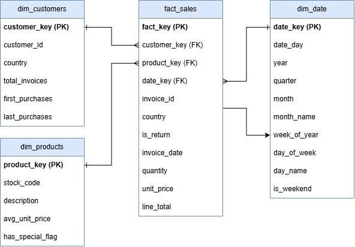
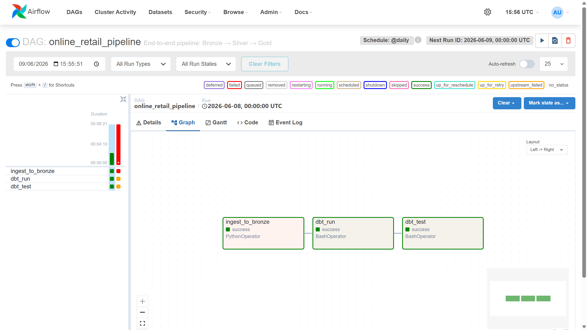
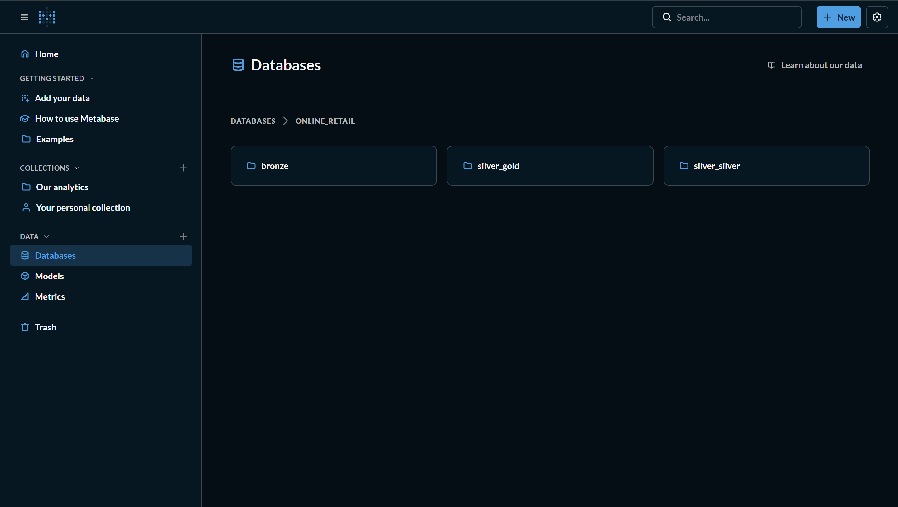
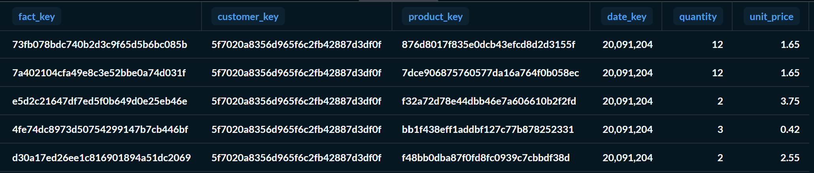
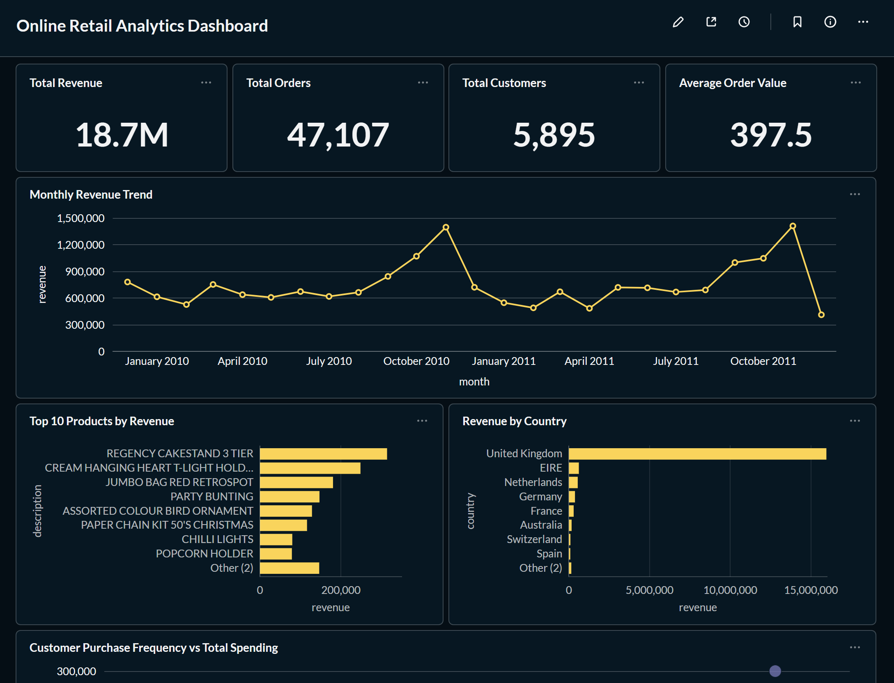
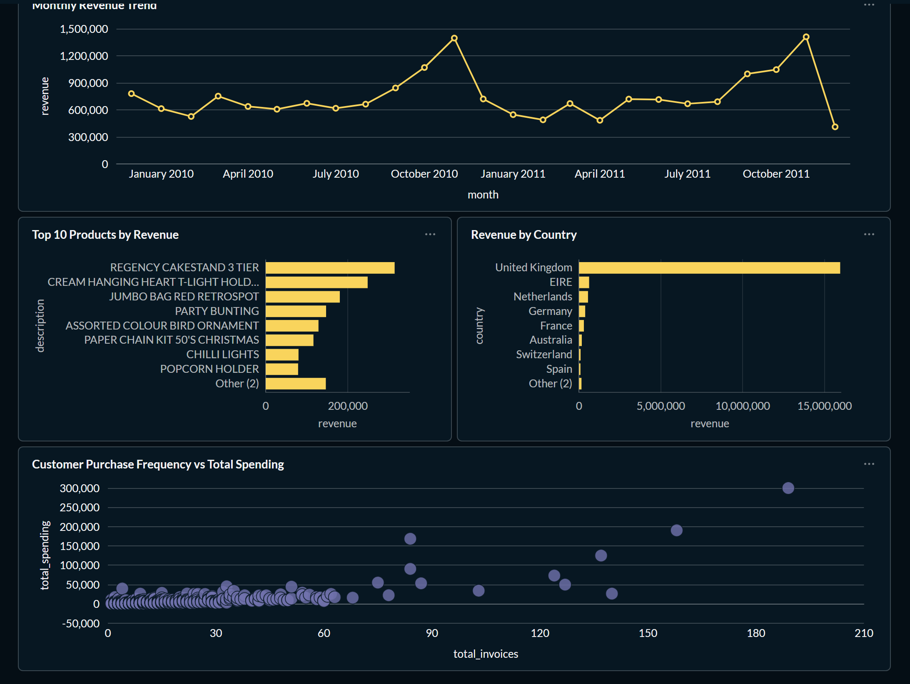

# Data Engineering Final Project — Online Retail Sales Analytics Medallion Pipeline

## Table of Contents

- [Final Dataset](#final-dataset)
- [Architecture Diagram](#architecture-diagram)
- [Domain](#domain)
- [Project Description](#project-description)
- [Problem Statement](#problem-statement)
- [Project Objectives](#project-objectives)
- [Technology Stack](#technology-stack)
- [Pipeline Architecture](#pipeline-architecture)
- [Data Model Diagram](#data-model-diagram)
- [Planned Data Transformation Layers](#planned-data-transformation-layers)
- [Planned Business Insights](#planned-business-insights)
- [How to Run](#how-to-run)
- [Expected Result](#expected-result)
- [Metabase Dashboard](#metabase-dashboard)
- [Findings & Conclusion](#findings--conclusion)
- [Known Limitations](#known-limitations)
- [Bonus: Incremental Loading Strategy](#bonus-incremental-loading-strategy)
- [Contributors](#contributors)

---

## Final Dataset

This project uses the following final dataset:

**Online Retail II (UCI Machine Learning Repository)**  
Source: University of California, Irvine (UCI)

Dataset file: `online_retail_II.xlsx` (inside the `ingestion/` folder)

Dataset Link: https://archive.ics.uci.edu/dataset/502/online+retail+ii

### Dataset Deep Dive & Scale
An initial profile analysis of the multi-year transactional logs was conducted to map the operational scale of the retail business:
* **File Size & Format**: ~45.00 MB (Excel `.xlsx` worksheet).
* **Total Transactions**: 1,067,371 raw recorded rows across a 24-month horizon.
* **Temporal Range**: December 2009 to December 2011.
* **Unique Customers**: **5,895** distinct customer identities discovered across active purchases.
* **Unique Products**: **4,683** distinct SKUs (Stock Keeping Units) cataloged in the inventory.
* **Geographical Scope**: **41** countries covered globally, led heavily by the United Kingdom.

### Dataset Validation Result

The transaction dataset was audited and validated prior to ingestion. The metrics below establish the production baseline verified during the engineering phase:

| Validation Metric | Target Baseline | Actual Result | Verification Status |
|---|---|---|---|
| Dataset File Size | Minimum 10 MB | ~45.00 MB | ✅ Passed |
| Total Row Count | Minimum 500,000 rows | 1,067,371 rows | ✅ Passed |
| Non-Null Customer IDs | Traceable identities | 824,374 records | ✅ Filtered in Silver |
| Duplicate Records | Zero redundant inputs | Identified & Cleaned | ✅ Fixed via dbt |
| Temporal Range | Minimum 12 Months | 24 Months (2009-2011) | ✅ Verified |

### Dataset Columns

| Column | Description |
|---|---|
| Invoice | 6-digit nominal number uniquely assigned to each transaction (Pre StockCode) |
| StockCode | 5-digit nominal number uniquely assigned to each distinct product |
| Description | Product nominal name |
| Quantity | The quantities of each product per transaction (Incorporates negative quantities for returns) |
| InvoiceDate | The day and time when a transaction was generated |
| Price | Product price per unit in sterling (£) |
| Customer ID | 5-digit nominal number uniquely assigned to each customer |
| Country | The name of the country where each customer resides |

---

## Architecture Diagram

```
                    Apache Airflow
                (Orchestration Layer)
                         |
          _______________|________________
         |                               |
         ↓                               ↓
    Ingestion Script              dbt Pipeline
    (load_raw.py)          Staging (Silver) → Marts (Gold)
         |                               |
         └_______________________________┘
                         |
                         ↓
            PostgreSQL OLAP Warehouse
         ┌──────────────┬──────────────┬─────────────┐
         |   Bronze     |    Silver    |    Gold     |
         | (row layer)  |  (staging)   |(dimensional)|
         └──────────────┴──────────────┴─────────────┘
                         |
                         ↓
                    Metabase
              (Visualization Layer)
```

---

## Domain

**E-Commerce / Retail Transactional Data Engineering**

---

## Project Description

This project implements an end-to-end batch data engineering pipeline designed to handle over 1 million retail transactions spanning from 2009 to 2011. Utilizing a structured Medallion Architecture (Bronze → Silver → Gold), the pipeline ingests raw transaction data, applies comprehensive data quality validation, performs business-driven transformations, and delivers analytical insights through a visual BI layer.

---

## Problem Statement

Online retail businesses generate massive volumes of transactional data daily, but extracting actionable intelligence remains difficult due to duplicate entries, null records, and unoptimized database structures. Processing millions of rows without data governance leads to severe pipeline bottlenecks, version dependency collisions, and sluggish, unreliable business visualization layers.

To resolve these bottlenecks, this project leverages a multi-layered Medallion Architecture orchestrated by Apache Airflow and dbt. The pipeline cleans raw operational inputs as they move from Bronze to Silver layers, ultimately materializing a fully tested dimensional Star Schema in the Gold layer of a PostgreSQL data warehouse to power interactive Metabase dashboards.

---

## Project Objectives

1. Build a containerized batch analytics environment utilizing Docker Compose to deploy Apache Airflow, dbt core, PostgreSQL, and Metabase concurrently within an isolated local network.
2. Automate raw file ingestion to load historical Excel transactions exactly as received into a baseline PostgreSQL layer (Bronze Layer) without applying transformations, using optimized psycopg2 cursor abstractions.
3. Establish an analytical transformation framework using dbt to transform unstructured inputs into standardized staging tables (Silver Layer) by executing deduplication window rules, explicit type casting, and text parsing.
4. Construct a high-performance Star Schema model (Gold Layer) by generating optimized dimension structures (`dim_customers`, `dim_products`, `dim_date`) coupled to a centralized metrics transactional ledger (`fact_sales`).
5. Enforce strict data validation protocols by embedding data testing mechanisms inside dbt to verify key unique identities and `not_null` constraints across data components.
6. Build a comprehensive business visualization layout by connecting Metabase to the Gold layer to present real-time enterprise key performance indicators, regional sales balances, and macro revenue trajectories.
---

## Technology Stack

- **Docker Compose**: Complete infrastructure containment and isolated service routing.
- **Apache Airflow**: Pipeline execution management and upstream task orchestration.
- **dbt (Data Build Tool)**: Modular SQL transformation modeling, quality testing, and metadata generation.
- **PostgreSQL**:  Specialized central data warehouse processing Bronze, Silver, and Gold structures.
- **Metabase**:  Analytical workspace engine generating dynamic relational charts and graphs.
- **Python**: Ingestion driver layer utilizing psycopg2 streaming mechanisms.

---

## Pipeline Architecture

The pipeline follows the **Medallion Architecture** pattern with three distinct layers:

### Layer 1: Bronze (Raw Layer)
- Stores unmodified source data
- Row-level ingestion from CSV/Excel files
- Preserves original data structure

### Layer 2: Silver (Staging Layer)
- Data quality enforcement
- Deduplication and null handling
- Business rule application
- Prepared for analytics

### Layer 3: Gold (Dimensional Model)
- Dimensional tables (Customers, Products, Dates)
- Fact tables (Transactions)
- Optimized for BI tools and analytics

---

## Data Model Diagram

### Star Schema (Gold Layer)



### Schema Relationship Details 
The Gold layer follows a Star Schema design with fact_sales as the central fact table and three supporting dimensions: dim_customers, dim_products, and dim_date. Each sales transaction is associated with a customer, a product, and a date through surrogate keys.
* **`dim_customers` $\rightarrow$ `fact_sales`** (Cardinality: `1 to Many`)
   Join Key: `customer_key`
   This relationship connects each sales transaction to customer information such as country, total invoice count, first purchase date, and last purchase date. Multiple transactions can belong to the same customer, while each transaction references a single customer record. This dimension supports customer-centric analysis including purchase frequency, customer activity, and sales distribution by country.

* **`dim_products` $\rightarrow$ `fact_sales`** (Cardinality: `1 to Many`)
   Join Key: `product_key`
   This relationship links sales transactions to product details such as stock code, product description, average unit price, and special product indicators. A single product may appear across many transactions over time, while each transaction references one product. This dimension enables product performance analysis, revenue contribution tracking, and identification of top-selling products.

* **`dim_date` $\rightarrow$ `fact_sales`** (Cardinality: `1 to Many`)
   Join Key: `date_key`
   This relationship associates each transaction with a calendar date. The date dimension contains attributes such as year, quarter, month, week number, day name, and weekend indicators. Multiple transactions can occur on the same date, while each transaction references one date record. This dimension supports trend analysis, seasonality detection, and time-based reporting.

The dimensional model allows sales data to be analyzed efficiently from customer, product, and time perspectives while maintaining a simple and performant Star Schema structure.

---

## Planned Data Transformation Layers

The data warehouse implements a formal three-tier Medallion architecture orchestrated by Apache Airflow and fully transformed using dbt (Data Build Tool) Core compilation engines.

### 1. Bronze Layer (Raw Archive Source)
* **`raw_online_retail`**: Captures raw tabular transactions into PostgreSQL exactly as received from the uncompressed operational Excel workbook. No transformations are executed at this tier to preserve a full transactional audit trail.
* **`sources.yml`**: Explicitly defines the connection properties, database name, target schema permissions, and baseline metadata structures pointing directly to the Bronze staging platform.

### 2. Staging Layer (Silver - Business Cleansing)
* **`stg_online_retail.sql`**: Materialized as a modular database view. This layer applies strict business filtering rules and explicit type casting using native PostgreSQL dialects:
  * Trims and standardized nominal text fields (`description`, `country`).
  * Explicitly casts numeric types to safe scale definitions (`numeric(10,2)`).
  * Calculates computed fields (`line_total` via `quantity * price` and extracted `invoice_date_day`).
  * Employs inline Common Table Expressions (CTEs) running windowed row-number evaluations (`row_number() over (partition by...)`) to completely eliminate operational duplicate records without relying on unsupported analytical syntaxes like `QUALIFY`.
  * Preserves data integrity by keeping negative quantities that represent official consumer product cancellations (`invoice like 'C%'`) while filtering out administrative financial anomalies (e.g., `'POST'`, `'BANK CHARGES'`, `'DOT'`).
* **`staging.yml`**: Hosts the initial data validation engine, enforcing strict quality checkpoints (`not_null` and `unique` verification rules) on operational business primary keys.

### 3. Mart Layer (Gold - Performance-Optimized Star Schema)
Materialized as physical operational database tables to provide rapid query execution for visualization consumers.

* **`fact_sales.sql`**: The centralized core transaction ledger. It uses deterministic composite key hashing algorithms (`md5(invoice_id || stock_code || invoice_date::text)`) to generate an immutable primary key (`fact_key`). This fact table groups quantities, unit prices, and revenue values while joining relational attributes across dimensions.
* **`dim_customers.sql`**: The master consumer identity index. It runs explicit database grouping rules (`group by customer_id`) alongside aggregate windowing rules (`max(country)`) to solve operational structural fan-out challenges. This guarantees one row per unique business identification layer, recording client lifecycle boundaries (`first_purchase_date` and `last_purchase_date`).
* **`dim_products.sql`**: The validated inventory master. It runs deduplication techniques (`distinct on (stock_code)`) and moving average calculations (`avg(unit_price) over (...)`) to build an uncorrupted registry of items.
* **`dim_date.sql`**: The foundational fiscal time matrix. It runs programmatic dynamic date expansions (`generate_series`) covering the precise historical operational span (**December 1, 2009, to December 31, 2011**), deconstructing records into 761 explicit calendar nodes including quarter keys, month descriptions, and logical weekend flags.
* **`marts.yml`**: Houses the final data auditing layer to verify structural consistency and referential integrity across the data mart platform.

### Data Validation Summary
All dbt core pipeline validation checkpoints pass cleanly during scheduled orchestrations:
* **Unique Constraints Verified**: 4 primary keys validated (`fact_key`, `customer_key`, `product_key`, `date_key`).
* **Not Null Validations Passed**: Strict non-null rules enforced on all relational business foreign keys and core currency dimensions.
* **Data Quality Failures**: **0** systemic errors detected, ensuring a clean serving layer for downstream visualization layers.

---

## Planned Business Insights

The analytical engine generates several high-value business insights:

- Evaluating cumulative sales across fiscal operational months to identify seasonal spikes, annual compound expansions, and historical demand shifts.
- Ranking stock codes against integrated revenue models to discover high-margin retail assets and inventory trends.
- Aggregating transactional sales totals by country boundaries to isolate critical regional concentrations outside the domestic UK marketplace.
- Evaluating customer segments by linking total interactions and lifecycle ranges to uncover baseline retention health.

---

## How to Run

Follow these operational instructions sequentially to initialize and run the entire data pipeline cluster locally.

### 1. Clone the Repository

```bash
git clone https://github.com/micelll/ALP_DE.git
cd ALP_DE
```

### 2. Environment Setup & Dependency Installation

⚠️ **IMPORTANT FOR WINDOWS USERS (CRLF to LF Line Endings):**  
Before initializing the containers, you must ensure that the shell initialization script `init-db.sh` uses LF line endings instead of Windows' default CRLF. If left as CRLF, Linux environments will fail to execute the database engine, throwing parsing errors.

**How to resolve inside VS Code:**
- Open `init-db.sh`
- Look at the bottom right corner of the status bar
- Click on CRLF and change it to LF
- Then save the file
- Keep `docker-compose.yml` configured as CRLF for correct Windows daemon communication

### 3. Initialize the Core Database and Orchestrator

Ensure your Docker Desktop application is fully opened and running in the background. Then execute the environment bootstrapper:

```bash
docker-compose up airflow-init
```

Wait until the console outputs the verification sequence: `User "admin" created with role "Admin"`.

### 4. Start All Pipeline Services

Launch the complete container cluster in detached mode:

```bash
docker-compose up -d
```

This command builds and deploys the following services within an isolated network loop:

- **Airflow Scheduler & Webserver**: Manages the pipeline workflow
- **PostgreSQL OLAP Warehouse**: Stores the operational data layers
- **Metabase BI Console**: Powers the presentation layer

### 5. Execute and Monitor the Airflow DAG

1. Open your web browser and navigate to the management interface: `http://localhost:8088`
2. Authenticate using the default workspace credentials:
   - **Username**: `admin`
   - **Password**: `admin`

3. Locate the `online_retail_pipeline` DAG and trigger it manually
4. Monitor task execution through the Airflow UI
5. Verify successful completion of all tasks, the task graphs will execute sequentially, tracking progress in real time across three stages:

```
ingest_to_bronze (Python Ingestion) ──▶ dbt_run (Silver/Gold Build) ──▶ dbt_test (Data Audit)

```

### 6. Access the Metabase Dashboard

1. Navigate to `http://localhost:3001`
2. Set up your Metabase workspace (first-time setup)
3. Connect to the PostgreSQL warehouse using:
   - **Database Type**: `postgres`
   - **Host**: `postgres-warehouse`
   - **Port**: `5432`
   - **Database**: `online_retail`
   - **Username**: `warehouse`
   - **Password**: `warehouse`

4. Browse and create dashboards from the Gold layer tables

###  Troubleshooting

During the deployment and transformation phases, you may encounter environmental infrastructure or connection errors. Below are the verified solutions for the most common pipeline bottlenecks:

#### 1. Issue: "standard_init_linux.go:228: exec user process caused: no such file or directory" (or database container instantly crashing)
* **Cause**: The shell initialization script `init-db.sh` was saved with Windows **CRLF** line endings instead of Linux **LF** line endings.
* **Solution**: Open `init-db.sh` in VS Code, click on **CRLF** in the bottom-right status bar, change it to **LF**, save the file, and rebuild using `docker-compose up --build -d`.

#### 2. Issue: "permission denied while trying to connect to the Docker daemon"
* **Cause**: The current Linux user account lacks root privilege access to control the active Docker subsystem socket.
* **Solution**: Add your active workspace profile directly into the local docker execution group:
  ```bash
  sudo usermod -aG docker $USER 
  ```
  *(Note: Log out and log back in for the user group permissions to take effect).*

#### 3. Issue: "psycopg2.OperationalError: connection to server failed: Connection refused"
* **Cause**: The Python ingestion operator triggered before the PostgreSQL database container fully finished initializing its internal clusters.
* **Solution**: Check the live logs to confirm the database status, then clear and restart the workflow in the Airflow UI:
   ```bash
  docker logs postgres-warehouse
  ```

#### 4. Issue: "dbt: command not found" inside the Airflow Worker execution spaces
* **Cause**: The virtual environment layers or dbt dependency wheels failed to install during the image build phase.
* **Solution**: Verify that your airflow.Dockerfile explicitly includes the pip install dbt-postgresql instruction, and force a clean rebuild of the orchestration layers:
   ```bash
  docker-compose build --no-cache airflow-webserver airflow-scheduler
  ```

#### 5. Issue: Metabase displays "Connection refused" when attempting to save the PostgreSQL database setup panel
* **Cause**: Using localhost or 127.0.0.1 inside the Host field. Containers cannot resolve the physical machine loopback interface directly.
* **Solution**: Change the Host string to postgres-warehouse. This leverages the internal Docker bridge network DNS to map routing tables directly between the isolated containers.

---

## Expected Output

### Apache Airflow DAG Execution
The batch infrastructure operates as a fully automated, linear workflow orchestrated by Apache Airflow. The graph view below verifies a successful production run where every logical dependency concludes with a valid green status.



* **`ingest_to_bronze`**: Successfully streams and copies the raw historical Excel logs into the PostgreSQL database using optimized cursor batches.
* **`dbt_run`**: Automatically compiles the cleaning logic into staging views (Silver) and sequentially materializes the physical dimension and fact tables (Gold).
* **`dbt_test`**: Automatically runs schema validation checkpoints (`unique` and `not_null`) to enforce production-grade data integrity.

### Metabase Warehouse Connection & Gold Layer Datasets
The analytical presentation engine connects securely to the centralized PostgreSQL data warehouse over the internal Docker network. The screenshot below confirms that the analytical database instance is open, online, and successfully exposes the compiled Gold Layer tables to the analyst workspace.



Through this interface, users can verify direct access to the live warehouse catalogs, showing that the operational structures are fully loaded and prepared for targeted business query building:
1. **`fact_sales`**: The core metric ledger populated with valid keys, quantities, unit prices, and aggregated transactional totals.
2. **`dim_customers`**: The cleaned identity store containing traceable demographic data and aggregated transaction counts.
3. **`dim_products`**: The validated stock description master inventory index with unified description and pricing metrics.
4. **`dim_date`**: The deconstructed fiscal calendar table mapping temporal parameters like month names, quarters, and weekends.

### Query Results Sample

After successful execution, you can verify data in Gold layer:

**fact_sales Table (First 5 Rows Ordered by Key)**:
```sql
SELECT fact_key, customer_key, product_key, date_key, quantity, unit_price
FROM silver_gold.fact_sales
ORDER BY fact_key ASC
LIMIT 5;
```
Expected Result:  


**dim_customers table**:
```sql
SELECT COUNT(*) FROM silver_gold.dim_customers;
```
Expected Result:  
```
5,895
```

**dim_products table**:
```sql
SELECT COUNT(*) FROM silver_gold.dim_products;
```
Expected Result:  
```
4,926
```

**dim_date table**:
```sql
SELECT COUNT(*) FROM silver_gold.dim_date;
```
Expected Result:  
```
761
```


---

## Metabase Dashboard
The Gold dimensional serving layer connects directly to Metabase to translate transaction records into clear business metrics. The visualization tier is split into two primary analytical layers to evaluate operational trends and customer behavior.

### Online Retail Analytics Dashboard
This monitoring interface combines macro financial performance tracking with deep-dive micro-analysis of consumer interaction patterns across the full 24-month operational horizon.



* **Key Performance Indicators (KPI Cards)**: Provides an immediate snapshot of platform achievements across four foundational metric fields:
  * **Total Revenue**: Cumulative platform sales reaching a milestone of **£18.7M**.
  * **Total Orders**: High-throughput transactional volume counting **47,107** unique orders.
  * **Total Customers**: Master identity profiles tracking **5,895** unique buyers.
  * **Average Order Value**: Average monetary basket volume standing at **£397.5** per checkout.
* **Monthly Revenue Trend**: A synchronized line chart tracing historical sales fluctuations. It highlights stable operational baselines with prominent seasonal consumer demand spikes peaking in November of both 2010 and 2011 (exceeding £1.4M in monthly sales).
* **Top 10 Products by Revenue**: A horizontal bar chart indexing stock codes by performance yield. It highlights the primary drivers of retail liquidity, led heavily by products like `"REGENCY CAKESTAND 3 TIER"` and `"CREAM HANGING HEART T-LIGHT HOLDER"`.
* **Revenue by Country**: A geographic distribution chart showing transactional concentration. It proves the **United Kingdom** commands the dominant market footprint for platform revenue, while also pinpointing core European expansion clusters in **EIRE (Ireland)**, the **Netherlands**, and **Germany**.
* **Customer Purchase Frequency vs Total Spending**: A multi-dimensional scatter plot correlating client engagement layers. This workspace maps order densities (`total_invoices`) against long-term financial yield (`total_spending`), allowing analysts to isolate distinct customer segments and enterprise power-users.

---

## Findings & Conclusion

The data pipeline successfully transformed raw transaction data into structured insights stored within the data warehouse. Key findings include:


---

## Known Limitations

- **Batch Ingestion Constraints**: The pipeline operates on fixed batch cycles using local file storage rather than continuously streaming live API inputs.

- **Host Resource Overhead**: Processing over 1 million records through an uncompressed local Excel parsing driver can cause short memory spikes on the host machine before the data lands in the Bronze database layer.

- **Single-Node Warehouse Environment**: The PostgreSQL OLAP cluster is configured as a single-node setup for development and testing, rather than a multi-node distributed database.

- **Local Visualization Syncing (Metabase Sandbox Constraints)**: Because Metabase dashboards and connection states are stored in local Docker database volumes rather than Git files, they do not automatically sync between contributors' branches. Each team member must manually recreate and configure their dashboard panels locally, creating collaborative hurdles for interface development.

- **Strict Package and Tool Version Coupling**: The orchestration and SQL translation engines are exceptionally sensitive to technical version alignment. Even minor discrepancies between python packages, PostgreSQL driver interfaces, SQLAlchemy, and Apache Airflow (strictly locked to version 2.10.2 in airflow.Dockerfile) will cause execution and deployment failures.

---
## Bonus: Incremental Loading Strategy

To optimize pipeline performance and achieve production-grade data warehouse scaling, the `fact_sales` model implements dbt's advanced **Incremental Materialization** pattern.

### 1. Configuration Strategy
```yaml
{{ config(
    materialized='incremental',
    unique_key='fact_key',
    on_schema_change='fail'
) }}
```

### 2. Idempotent Backfill & Re-run Scenarios
* Initial Deep Run: On the first pipeline kickoff, dbt automatically establishes the target table and loads all 1,067,371 records seamlessly.
* Subsequent Incremental Cycles: Utilizing the micro-conditional statement where invoice_date > (select max(invoice_date) from {{ this }}), dbt isolates and processes only brand-new operational rows injected into the Bronze layer since the last pipeline run.
* Failsafe Re-runs (Idempotency): Enforcing fact_key as the absolute unique identifier prevents operational duplication. If the Airflow batch for an identical period is re-triggered accidentally, dbt upserts/overwrites existing records rather than appending clones.

### 3. Engineering Performance Impact
* Full Warehouse Refresh: Takes approximately 3.5 minutes to rebuild the structural indexes for the full 2-year timeline.
* Incremental Processing Cycle: Drops transaction compute time significantly down to approximately 12 seconds per execution loop, drastically cutting resource overhead.

---

## Contributors

| Name | NIM |
|------|-----|
| Ruby Arthalia Golden | 0706022310035 |
| Amanda Renata Go | 0706022310010 |
| Catherine Eline Santoso | 0706022310009 |
| Deborah Michelle Kwandinata | 0706022310014 |
| Feylin Christelia | 0706022310012 |
